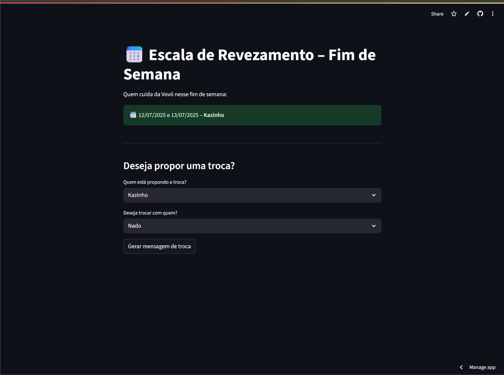

# Escala da Vovó – Revezamento Familiar Automatizado

Um app super simples feito com [Streamlit](https://streamlit.io/) (pensando em pessoas com dificuldade em tecnologia) para resolver um problema real da minha família: organizar a escala de revezamento entre os filhos para cuidar da minha avó nos fins de semana.

### Problema

A escala era combinada no grupo de WhatsApp, mas com frequência havia trocas, esquecimentos e confusões — principalmente porque nem todos tinham facilidade com tecnologia.

### Solução

Um app leve, direto e sem complicação. A pessoa entra pelo link, vê quem é o responsável pelo fim de semana atual e, se precisar, gera automaticamente uma mensagem para propor troca com outro familiar.

---

### ⚙️ Como funciona

- Mostra quem cuida da vovó no **sábado e domingo atuais**
- Permite selecionar **quem quer trocar** e **com quem**
- Gera uma **mensagem pronta para o WhatsApp**
- Tudo 100% online e sem necessidade de login, instalação ou cadastro

---

### 📦 Tecnologias usadas

- [Python](https://www.python.org/)
- [Streamlit](https://streamlit.io/)
- [GitHub](https://github.com/) para hospedagem do código
- [Streamlit Cloud](https://streamlit.io/cloud) para publicação gratuita

---

## Demonstração

---

### Autor

Desenvolvido por [Felipe Araújo](https://www.linkedin.com/in/felipetorres-tech), como parte do projeto de transição de carreira para o mundo digital.  
Sou engenheiro de automação em transição estratégica para o digital, focado em soluções simples que economizam tempo e reduzem retrabalho.

---

### Possibilidades futuras

- Registro automático das trocas
- Envio direto para o WhatsApp
- Rotação automática da escala mês a mês
- Versão para empresas e plantões de equipe

---

> Projeto simples, mas com propósito real.

